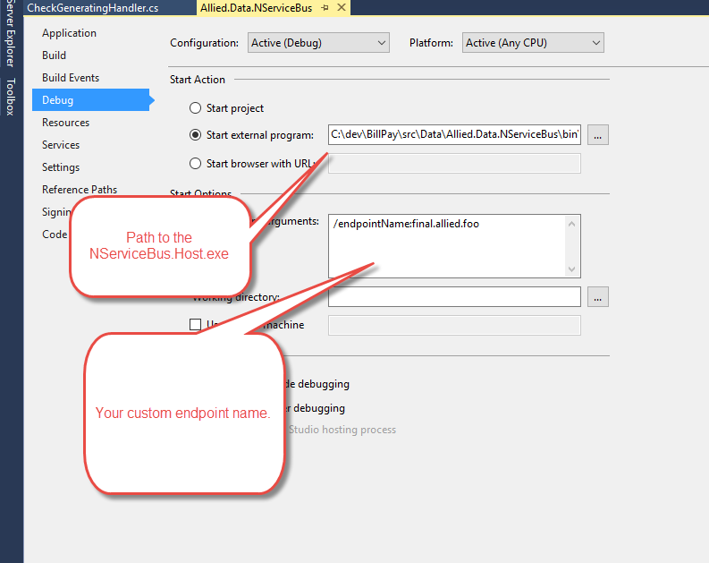

#NServiceBus

##Test NServiceBus
cd into work dir
nservicebus.host /endpointName:test

##Install Service Example
NServiceBus.Host.exe /install /servicename:#{queue}.#{workername} /endpointName:#{queue} NServiceBus.Profiles.RabbitMQ /displayname:Allied.Worker #{queue}.#{workername}")

NServiceBus.Host.exe /install /servicename:final.allied.normal.1 /endpointName:final.allied.normal NServiceBus.Profiles.RabbitMQ /displayname:Allied.Worker final.allied.normal.1

##Visual Studio
Use Visual Studio to run a local worker by configuring your app like the image below. This will handle which queue is being listened to by your worker.



Your outbound messages need to be put onto your queue with this in the configuration:
```
<UnicastBusConfig>
    <MessageEndpointMappings>
      <add Messages="Allied.Data.NServiceBus.Messages" Endpoint="final.allied.foo" />
    </MessageEndpointMappings>
  </UnicastBusConfig>
  ```
