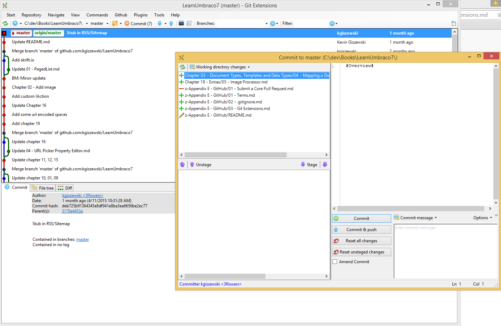

#Git

##Terms##

Some terms that you should know about Git that will help the conversation.

**Repository** - A container for each project, repos can be public or private.  GitHub's revenue model is based on how many private repos you can have.

**Branches** - Repos have branches.  Typically you will have two branches that live forever, *Master* and *Develop*.  *Master* usually represents live deployed production code while *develop* is code not yet ready for prime-time.  You can create as many branches as you want and you typically create a new branch off of either *Master* or *Develop*.

**Commit** - A commit is a logical grouping of changes to your project.  A commit can be one or more lines in a file and can include one or more files.  Think of a commit as block of changes across your project.

**Merge** - When two branches evolve separately, you can move commits from one branch to another through a merge.  Merges are directional meaning if you merge from *branch 1* to *branch 2*, *branch 2* will now include changes made on *branch 1*.  *Branch 1* will not include commits from *branch 2* unless you then merge from *branch 2* to *branch 1*.

**Cherry Pick** - A cherry pick is when you want to grab a single commit and apply it to a branch.  This differs from a merge that compares and moves all commits to a branch.

**Clone** - A clone happens the first time you download a repo from GitHub.

**Pull** - A pull occurs when you pull down updates to your local machine from GitHub.

**Push** - A push occurs when you push updates from your local machine to GitHub.

**Local Repo** - You local machine is running Git and you can make changes through commits.  Until you push to GitHub, you can revise your changes.

**Origin** - This is Git-speak for GitHub.

**Head** - Changes to your repo occurs through commits that are sequentially recorded in your branch history.  Think of the *head* as the pointer to a particular commit.  If you move the *head* back to an earlier commit, your files will change to what they were at the time of the commit.  This creates a bit of a time-machine effect.

**Staged Files** - Before you can actually commit your changes, you have to *stage* your changes by selecting what is ready.

**Working Changes** - Changes that Git has detected but not yet committed.  You will stage some or all of these changes when forming your commit.

**.gitignore** - This is a file that you local Git will use to decide if it will ignore certain files.  By default it will track all files in a repo, but there are many files you should avoid tracking (i.e. NuGet source files, /bin, etc).  There is a sample `.gitignore` file in the next section.

**Fork** - A fork is the copying of another users repo into your user account.  This is the first step if you want to contribute to another users' project.  A reference back to the parent project is kept so you can grab the new changes when the original repo updates.

**Pull Request** - Since you can't directly modify another users' repo (due to permissions), you can *fork* a repo, make changes and then send the changes to the origin repo.  This sending of changes is done by creating a pull request.  A pull request shows a project owner a summary of the proposed changes.  If accepted, the repo owner merges in your changes.

**Merge Conflict** - A merge conflict occurs when Git can't figure out what to do when two or more changes seem to conflict with each other during a merge.  To resolve, open the file(s) with the conflict and change the file to the way it needs to be.  Git will insert `<<<<` characters denoting the changes that conflict.  Once you make the file 'right', you will then be able to complete the commit/merge.

##Git Extensions

Git Extensions is a free tool that helps users (new and old) operate their local Git repos.  You can download it [here](https://code.google.com/p/gitextensions/).  Installation may seem daunting, but please read each of the installation panels and when in doubt, just take the defaults.  By installing Git Extensions, you are also installing Git itself which is required if you want to actually *use* Git.

###Why use Git Extensions?
Git Extensions visualizes you commit history and provides a GUI to perform many of the command line interface (CLI) functions.  Many developers use Git Extensions in a hybrid way meaning they use the GUI for some things and using CLI commands for other things.

Git Extensions excels at graphically showing which files have changed and which lines have changed within them.  It has a great UI to stage your files as your choosing what you want to commit.

###Commit Something
When you open Git Extensions and click `Commit` along the top toolbar, you will see the staging/commit panel.  In order to commit a change, you need to stage one or more files.  You don't have to stage all of the files and may want to split up your changes into multiple commits.  You can even abandon changes by *resetting* a file before you commit it.  When you reset a file you discard all pending changes and nothing will get committed.  You can even reset a file that has been changed line by line.  Conversely you can even stage a file line by line.  For instance if you change your web.config in two spots but only want to commit one part right now, you can click the file in the top right, highlight the lines to commit in the top right, then press `s` to stage *just those lines*!

>Resetting and staging by line requires that a change actually is pending on those lines.

Finally once you have staged your changes, enter a commit and it is now committed locally.  When ready to notify GitHub, perform a push.

###Credentials
If you are using HTTPS for you communications, you may be getting prompted to enter your user/password during each remote request. You can have Git remember them by entering in the CLI:
`git config --global credential.helper wincred`

Find out more(here)[https://help.github.com/articles/caching-your-github-password-in-git/].